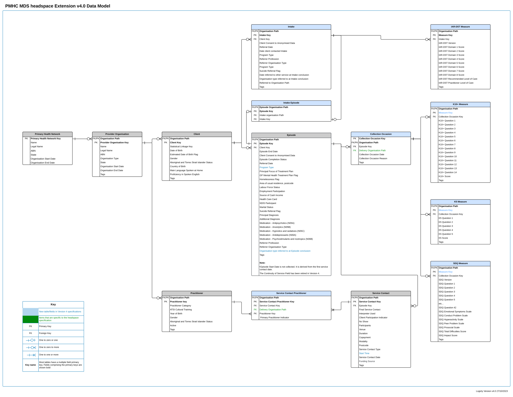

.. _data-model-and-specifications:

Data model and specifications
=============================

headspace specifications are an extension of the Primary Mental Health Care Minimum Data Set (PMHC MDS);
the current PMHC MDS Data model and specification rules still apply. These are available to be viewed at
https://docs.pmhc-mds.com/projects/data-specification/en/latest/index.html.

.. _key-concepts:

Key concepts
------------

See `PMHC MDS Key concepts <https://docs.pmhc-mds.com/projects/data-specification/en/v4/data-model-and-specifications.html#key-concepts>`_
for an explanation of key concepts used in the PMHC MDS.

.. _data-model:

Data model
----------

.. _data-model-diagram:

   headspace data model *within the PMHC MDS*

**Note:** `PMHC MDS Collection Occasion records <https://docs.pmhc-mds.com/projects/data-specification/en/v4/data-model-and-specifications.html#collection-occasion-diagram>`_ for more details about
Collection Occasion records.

.. _record-formats:

Record formats
--------------

.. _metadata-data-elements:

Metadata
^^^^^^^^

The Metadata table must be included in file uploads in order to identify
the type and version of the uploaded data.

.. csv-table:: Metadata record layout
   :file: record/metadata.csv
   :header-rows: 1

For this version of the specification the required content is shown in the
following table:

.. include:: shared/metadata-content.rst

----------

.. _provider-organisation-data-elements:

Provider Organisation
^^^^^^^^^^^^^^^^^^^^^

Same as standard `PMHC MDS Provider Organisation <https://docs.pmhc-mds.com/data-specification/data-model-and-specifications.html#provider-organisation-data-elements>`_.

----------

.. _practitioner-data-elements:

Practitioner
^^^^^^^^^^^^

Same as standard `PMHC MDS Practitioner <https://docs.pmhc-mds.com/data-specification/data-model-and-specifications.html#practitioner-data-elements>`_.

----------

.. _client-data-elements:

Client
^^^^^^

Same as standard `PMHC MDS Client <https://docs.pmhc-mds.com/data-specification/data-model-and-specifications.html#client-data-elements>`_.

----------

.. _intake-data-elements:

Intake
^^^^^^

See `PMHC MDS Intake <https://docs.pmhc-mds.com/projects/data-specification/en/latest/data-model-and-specifications.html#intake>`_ for definition of an intake.

Intakes are managed by headspace via upload.

.. csv-table:: Intake record layout
   :file: record/intake.csv
   :header-rows: 1

----------

.. _intake-episode-data-elements:

Intake Episode
^^^^^^^^^^^^^^

Same as standard `PMHC MDS Intake Episode <https://docs.pmhc-mds.com/data-specification/data-model-and-specifications.html#intake-episode-data-elements>`_.

----------

.. _episode-data-elements:

Episode
^^^^^^^

See `PMHC MDS Episode <https://docs.pmhc-mds.com/projects/data-specification/en/latest/data-model-and-specifications.html#episode>`_ for definition of an episode.

Episodes are managed by headspace via upload.

.. csv-table:: Episode record layout
   :file: record/episode.csv
   :header-rows: 1

----------

.. _service-contact-data-elements:

Service Contact
^^^^^^^^^^^^^^^

See `PMHC MDS Service Contact <https://docs.pmhc-mds.com/projects/data-specification/en/latest/data-model-and-specifications.html#service-contact>`_ for definition of a service contact.

Service contacts are managed by headspace via upload.

.. csv-table:: Service contact record layout
   :file: record/service-contact.csv
   :header-rows: 1

----------

.. _service-contact-practitioner-data-elements:

Service Contact Practitioner
^^^^^^^^^^^^^^^^^^^^^^^^^^^^

See `PMHC MDS Service Contact Practitioner <https://docs.pmhc-mds.com/projects/data-specification/en/latest/data-model-and-specifications.html#service-contact-practitioner>`_ for definition of a service contact practitioner.

Service contacts practitioners are managed by headspace via upload.

.. csv-table:: Service contact practitioner record layout
   :file: record/service-contact-practitioner.csv
   :header-rows: 1

----------

.. _collection-occasion-data-elements:

Collection Occasion
^^^^^^^^^^^^^^^^^^^

See `PMHC MDS Collection Occasion <https://docs.pmhc-mds.com/data-specification/data-model-and-specifications.html#collection-occasion>`_ for a definition of an outcome collection occasion.

Collection Occasions are managed by headspace via upload.

.. csv-table:: Collection Occasion record layout
   :file: record/collection-occasion.csv
   :header-rows: 1

.. _measure-data-elements:

Measures
^^^^^^^^

.. _intake_measures:

Measures at Intake
""""""""""""""""""

.. _iar-dst-data-elements:

IAR-DST
'''''''

Same as standard `PMHC MDS IAR-DST <https://docs.pmhc-mds.com/projects/data-specification/en/v4/data-model-and-specifications.html#iar-dst-data-elements>`_.

.. _episode_measures:

Measures during an Episode
""""""""""""""""""""""""""

.. _k10p-data-elements:

K10+
""""

Same as standard `PMHC MDS K10+ <https://docs.pmhc-mds.com/projects/data-specification/en/v4/data-model-and-specifications.html#k10p-data-elements>`_.

.. _k5-data-elements:

K5
""

Same as standard `PMHC MDS K5 <https://docs.pmhc-mds.com/projects/data-specification/en/v4/data-model-and-specifications.html#k5-data-elements>`_.

.. _sdq-data-elements:

SDQ
"""

Same as standard `PMHC MDS SDQ <https://docs.pmhc-mds.com/projects/data-specification/en/v4/data-model-and-specifications.html#sdq-data-elements>`_.

----------

.. _definitions:

.. include:: include/definitions.rst

.. _data-specifications-download:

Download Specification Files
----------------------------

Available for software developers designing extracts for the PMHC MDS, please
click the link below to download the PMHC MDS Specification files:

* `Specification zip <../_static/pmhcmds-spec-headspace-meta.zip>`_

These files conform to the CSV on the Web (CSVW) standard that is defined at https://csvw.org/.

They are used:

* to generate the :ref:`record-formats` and :ref:`definitions` sections of the data specification documentation
* in the first pass of upload validations
