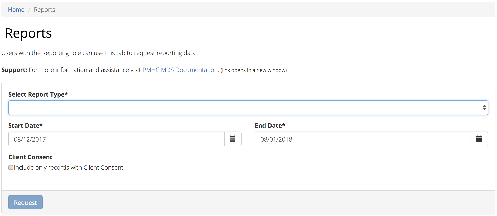
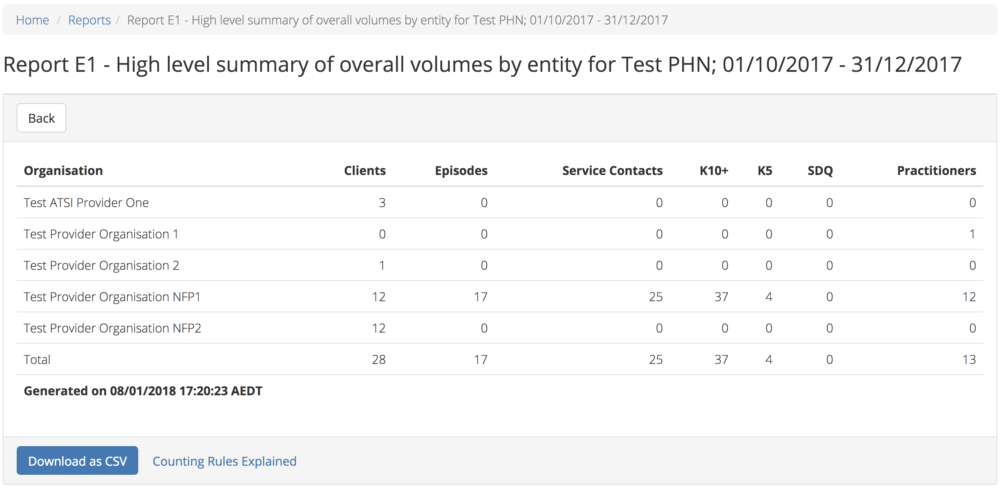

.. _reports-user-docs:

Reports User Guide
==================

headspace (TWB) Support Service Minimum Data Set is an extension of the
Primary Mental Health Care Minimum Data Set (PMHC MDS);
current PMHC MDS online User Guide for Reports is available to be viewed at
https://docs.pmhc-mds.com/projects/user-documentation/en/latest/reporting.html.

.. _produce-system-report:

How to produce a report
^^^^^^^^^^^^^^^^^^^^^^^

You can produce a system report by completing the fields in the **Reports** tab by
following these steps:

1. Navigate to the **Reports** tab

2. Select the type of report you would like to produce
3. If you are allowed to produce reports for more than one organisation you
   will be asked to select an organisation name
4. Select the name of the organisation from the drop down list
5. Click the first calendar icon to select the start date and then the second
   calendar icon to select the end date
6. If you click the **Include only records with Client Consent** tickbox, the
   data for clients that have not consented to their anonymised data being
   provided to the Department of Health will be excluded from your report. (See `Episode — Client Consent to Anonymised Data <http://docs.pmhc-mds.com/en/v1/data-specification/data-model-and-specifications.html#dfn-client-consent>`_ )
7. Click the blue **Request** button
8. Your report will be displayed on screen and can be downloaded as a CSV

Note: If you are not sure what data is displayed in a report, please click
on the **Counting Rules Explained** link.

.. _system-report-types:

Types of reports
^^^^^^^^^^^^^^^^

Standard PMHC MDS reports types are available at https://docs.pmhc-mds.com/projects/user-documentation/en/latest/reporting.html#types-of-reports. Some of the standard reports, namely the 'D' (KPIs) and 'E' series are not pertinent for headspace. However there are two headspace only reports - the A12 and the B7 - and contact-based reports are enhanced to allow breakdowns by funding source. 

headspace reports can be accessed by choosing 'hAPI (headspace)' from the "Select Data Source" selector on the 'Standard' tab.

The headspace-only reports are:

.. _category-a12:

A12 - Episodes shared across multiple organisations
+++++++++++++++++++++++++++++++++++++++++++++++++++

The PMHC model specifies that all activity (service contacts and collection occasions) for an episode must occur at the same organisation. The headspace model allows an episode of care to be delivered by multiple organisations. FOr compatability with the PMHC, reports based on hAPI data exclude episodes (and corresponding service contacts, collection occasions and potentially clients) that involve more than one organisation.

The A12 tallies the number of contacts/episodes/contacts/collections occasions that are delivered by multiple organisations. It is based on :ref:`active episodes`, defined as those that had one or more (non no-show) Service Contacts recorded in the period, and the number of episodes delivered at multiple organisations is what is reported in the 'Active Episodes' column.

The 'Service Contacts' column counts all the non no-show contacts in the reporting period that are associated with the 'Active Episodes'. Similarly the 

'Active Clients' is the enumeration of all clients for whom ALL episodes active during the reporting period were delivered at multiple organisations. A single episode during the reporting period delivered at only one organisation excludes client from this count.

.. _category-b7:

B7 - hAPI Funding Source
++++++++++++++++++++++++

Unlike data reported by PHNs, which is funded exclusively by the PHNs, data reported to hAPI is funded by many different sources. The B7 report provides a detailed breakdown of the funding source for each service contact. Only non no-show contacts during the reporting period are included.

In addition, the B7 aggregates the contacts into episode and client counts. An episode may have activity with more than one funding source, in which case it will be counted in every row for which it has a contact funded by the pertinent source. Unless all contacts for all episodes are funded by the same souce, the total number of episodes reported will be lower than the sum of the number of episodes in all funding sources. The same principle applies to Client counts.

Modified Reports
++++++++++++++++

As well as the new reports, the two existing reports that are concerned exclusively with contact data elements - the :ref:`category-A5` and the :ref:`B3` include an extra selector that allows filtering by Funding Source. Unlike the B7, which has 8 funding categories (including Missing), the filters on the A5 and B3 are less fine grained and include only 5 funding categories (including 'Missing').

